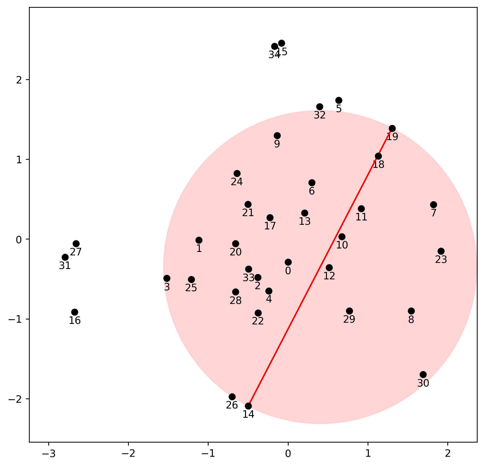
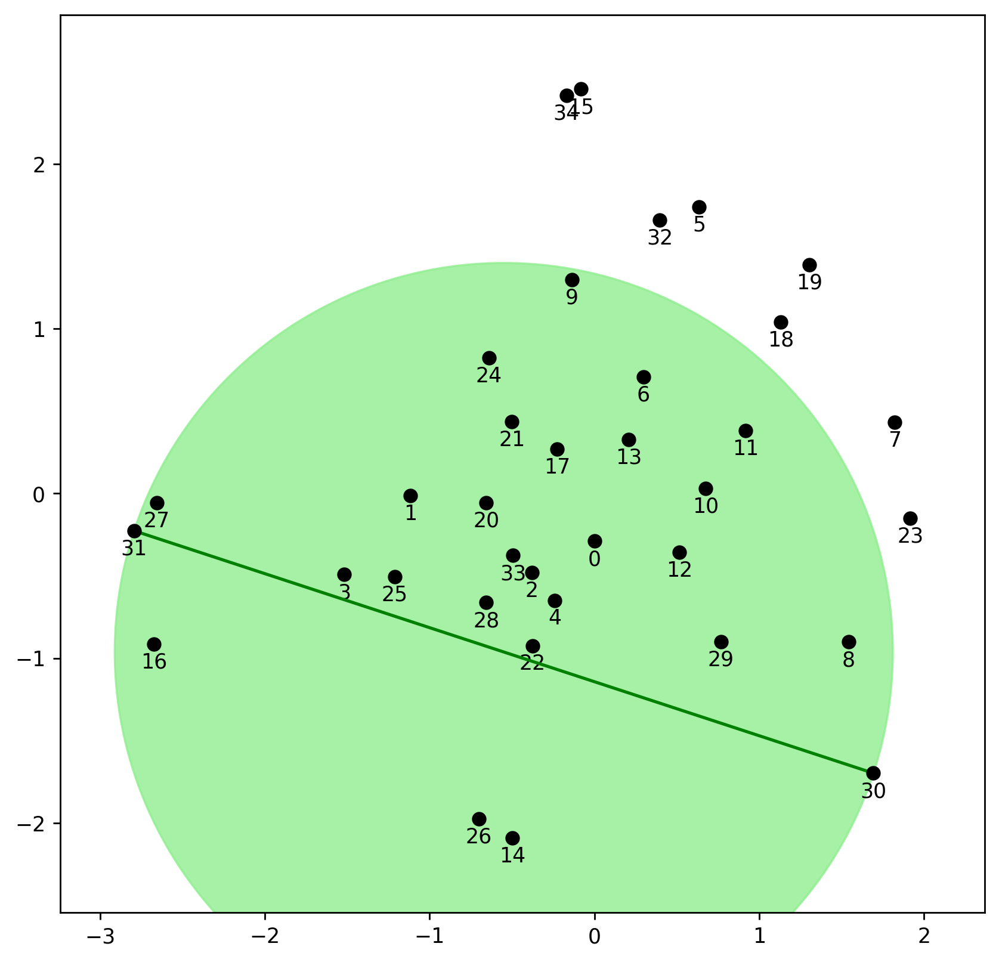

---
format: gfm
tags: ["posts"]
layout: single_md.pug
title: "Computing the Diameter in any dimension: Part I"
author: "Matt Piekenbrock"
date: '2022-02-12'
slug: diameter_1
include_toc: true
categories: ["C++"]
headers: [{id: "take-max", text: "Just take the max?"}]
draft: false 
--- 

The *diameter* of an $n$ point set $X \subset \mathbb{R}^d$ is defined
as the maximum [Euclidean
distance]((https://en.wikipedia.org/wiki/Norm_(mathematics)#Euclidean_norm))
between any two points:

$$ D(X) = \max_{x, x' \in X} \lVert x - x' \rVert_2 $$

<!-- More generally, one may start with an arbitrary metric space $(X, d_X)$ and use the same definition with the metric $d_X$.  -->

The diameter is a fundamental geometric primitive: many algorithms,
theorems, and applications in graphics and geometry often need $D(X)$
prior to performing some downstream task; and computing all pairwise
distances is costly.

In this post, I’ll introduce a way to compute $D(X)$ efficiently for
non-pathological inputs—in $\approx O(nh)$ time and $O(n)$ memory, where
$h << n$ for non-pathological
inputs—<span style="color: 'orange';">*independent of the
dimension*</span> $d$ of $X$. The algorithm outlined the following
paper, which I’m effectively summarizing in this post:

> Malandain, Grégoire, and Jean-Daniel Boissonnat. “Computing the
> diameter of a point set.” International Journal of Computational
> Geometry & Applications 12.06 (2002): 489-509.

The method is extremely fast, uses very little working memory, does not
involve any complicated data structures. Moreover, though it was
developed with the Euclidean metric in mind, the method is actually
extendeable to any metric.

<!-- Knowing the diameter of $X$ conveys a few things about the point set. Some examples:
1. The [smallest enclosing sphere](https://en.wikipedia.org/wiki/Smallest-circle_problem) has radius $R(X)$ satisfying $R(X) \leq \frac{1}{2}D(X) \sqrt{\frac{d}{2(d+1)}}$ ([Jung's Theorem](https://en.wikipedia.org/wiki/Jung%27s_theorem))
2. $\frac{1}{n} D(X) \leq \epsilon_\ast(X)$ where $\epsilon_\ast(X)$ is twice the minimum radius needed to ensure $\epsilon$-neighbor graph $N_\epsilon(X)$ is connected. 
3. Let $A, B \subseteq X$. Then $D(A \cup B) \leq D(A) + D(B) + d_H(A, B)$, where $d_H(A, B)$ is the Hausdorff distance 
4. Let $(X, d_X)$ and $(Y, d_Y)$ denote two metric spaces. Then 
   $$ \frac{1}{2} \lvert D(X) - D(Y)\rvert \leq d_{GH}(X, Y) \leq \frac{1}{2}\max\{D(X), D(Y)\}$$
   where $d_{GH}$ is the Gromov-Hausdorff distance ( [introduction video](https://www.youtube.com/watch?v=tvbkSt_QxnE) if you're curious )
As an aside, $\epsilon_\ast(X)$ can also be interpreted as the largest edge in the [metric minimum spanning tree](https://en.wikipedia.org/wiki/Euclidean_minimum_spanning_tree), which is useful itself in a variety of circumstances as this is the minimum radius one needs to ensure $N_\epsilon(X)$—the union of balls centered at points in $X$ with radii $\epsilon$—is connected.
By itself, the diameter is generally not a very informative quantity. Nonetheless, it is a useful quantity to have, as its often used as a building block other algorithms. Despite this, it's not immediately clear how to compute $D(X)$ efficiently. Let's look at some ways to go about doing just that.  -->
<h2 id="#take-max">
Just take the max?
</h2>

First off, let’s clear the air. Is computing all pairwise distances
really *that bad*?

Suppose $X \in \mathbb{R}^{n \times d}$ is our point cloud of interest.
Then we have a trivial one-liner to obtain $D(X)$ in Python via
[pdist](https://docs.scipy.org/doc/scipy/reference/generated/scipy.spatial.distance.pdist.html):

``` python
diameter = max(pdist(X))
```

Note the temporary inside the max expands to `np.ndarray`, thus this
approach takes *both* $O(n^2)$ time and $O(n^2)$ space.

Of course, a more memory efficient option using $O(1)$ memory and
$O(n^2)$ time is to, as above, enumerate all distances:

``` python
n, diam = X.shape[0], 0.0
for i in range(n):
  for j in range(i+1, n):
    diam = max(diam, np.linalg.norm(X[i,:] - X[j,:]))
```

or, more succinctly using the `combinations` generator from `itertools`:

``` python
diam = max(np.linalg.norm(xi - xj) for xi, xj in combinations(X, 2))
```

Amongst these solutions, can you guess which one is faster?

A quick benchmark with $\lvert X \rvert = 100$ shows the SciPy solution
takes 2.59 seconds to execute 100 times while the SciPy solution takes
just **0.035 seconds**—*a 74x* improvement.

Not surprising: there is high latency associated with memory-access in
Python and the vectorization benefits an optimized, low-level
implementation is bound to have. Thus, for very small point sets, the
naive yet vectorized solution is likely the way to go.

But the $O(n^2)$ memory for larger $n$ will simply kill the scalabilty
of the naive approach. Indeed, representing distances using 64-bit
floats, $10k$ points already incurs an overhead of
$\approx 50\mathrm{M}$ distance computations and $\approx 381$ MB of
working memory. This will not scale.

## Learning from low dimensions

It turns out there is a simple way to compute $D(X)$ in $O(n \log n)$
time. The idea is to first greatly simplify the problem by removing
points. It is motivated by the following fact:

> Any two points $x, x' \in X$ satisfying $d_X(x, x') = D(X)$ must lie
> on the boundary of the [convex
> hull](https://en.wikipedia.org/wiki/Convex_hull) of $X$

This is useful because now one can determine $D(X)$ using only the
points on the boundary of $\mathcal{C}(X)$—this is usually a *much*
smaller set. Thus, computing $D(X)$ can be reduced to the problem of
computing the convex hull $\mathcal{C}(X)$ of $X$, which can computed in
$O(n \log n)$ time e.g. using [SciPys port of
QHull](https://docs.scipy.org/doc/scipy/reference/generated/scipy.spatial.ConvexHull.html).

One can also first compute the Convex Hull of $X$ and then resort to the
brute force method: if $\mathcal{C}(X)$ has $h$ points on its boundary,
this method takes $O(n \log n + h^2)$ time, which can be very efficient
if $h << n$.

Here’s some example code:

``` python
from scipy.spatial import ConvexHull # Note this is just a port of QHull
diameter = max(pdist(X[ConvexHull(X).vertices,:]))
```

How well does this fare? Let’s do a quick test with 5k uniformly random
samples.

``` python
import timeit 
import numpy as np
X = np.random.uniform(size=(5000,2))
diameter_hull = lambda: max(pdist(X[ConvexHull(X).vertices,:]))
diameter_brute = lambda: max(pdist(X))

timeit.timeit(diameter_hull, number=30)
# >> 0.0359 (seconds)

timeit.timeit(diameter_brute, number=30)
# >> 19.023 (seconds)

diameter_hull() == diameter_brute()
# >> True
```

The naive brute-force computation, which was 74x faster than the \[very
naive\] raw python implemention, is
<span class="text-red font-bold decoration-solid"><u>533x
slower</u></span> than the convex hull solution. This shouldn’t be
surprising though: indeed, a order of magnitude difference in complexity
should yield a (roughly) order of magnitude difference in runtime. Since
[QHull](http://www.qhull.org/) is among the most highly optimized
softwares on the planet, we get the best of both worlds: the convex hull
shrinks the problem size significantly, and composing with brute-force
solution on the vertices of the hull leverages some vectorization
benefit, which is much simpler and likely faster than a generic Python
implementation of the rotating calipers method if the number of such
vertices is small.

So we’re done! The <code>diameter_hull</code> code shown above is very
efficient (for $d = 2$…)!

### Removing the $O(h^2)$ term - Rotating calipers

What is the number of points $h$ on the Convex Hull is large? On idea to
get around this is to use the [rotating
calipers](https://en.wikipedia.org/wiki/Rotating_calipers) method,
computes the diameter of a convex polygon in $O(n)$ time. The idea is
here is to generate antipodal points by (figuratively) rotating calipers
around the vertices of the convex hull until all antipodal points are
found. $D(X)$ is then found by taking the largest of these.

<div class="flex flex-row">


</img>

</img>

</div>

Above show two pictures to illustrate the intuition behind the rotating
calipers method, borrowed from [this great blog
post](https://geidav.wordpress.com/tag/rotating-calipers/). I recommend
checking out said post if you’re curious how it works. The left picture
shows a (non-convex) polygon, and the right-side shows the minimum
bounding box around different sets of vertices on the convex hull.
Notice that $D(X)$ can be derived from these as well, and that these
boxes only intersect points on the convex hull itself.

## The secret nobody tells you

It is often the case in computational geometry that one only considers
cases where $d = 2$, as many geometric truths are verifiable by hand
when working with the plane. Many geometric algorithms proven to work in
$O(n \, \mathrm{polylog}(n))$ time often *only do so* in the $d = 2$ or
very low $d$ setting: complexity statements often hide a constant-factor
which grows exponentially (or worse!) as $d \to \infty$.

Indeed, despite the ingenuity of the rotating calipers method, it’s not
immediately clear how to translate it to higher dimensions. There exists
3D generalizations, however they seem to not be used in practice.

*The convex hull is one such computation*. The *size* of the convex hull
$\mathcal{C}(X)$ of an $n$-point set $X$ scales as follows in $d$:

$$ \lvert \mathcal{C}(X) \rvert \sim \Omega(n^{\lfloor d/2 \rfloor})$$

Oof. The [curse of
dimensionality](https://en.wikipedia.org/wiki/Curse_of_dimensionality)
appear again. But, does this *actually* affect the computation? Maybe it
won’t be so bad.

Let’s generate a small set of 1.5k normally distributed random points in
$d$ dimensions for increasing $d$ and profile the time it takes to
compute $D(X)$ 30 times.

``` python
for d in [2, 3, 4, 5, 6, 7, 8, 9, 15]:
  X = np.random.normal(size=(1500, d))
  time_hull = timeit.timeit(diameter_hull, number=30)
  time_naive = timeit.timeit(diameter_naive, number=30)
```

And the results?

| dimension ($d$) | Brute force time (sec) | Convex Hull time (sec) |
|-----------------|------------------------|------------------------|
| 2               | 1.65                   | 0.02                   |
| 3               | 1.67                   | 0.02                   |
| 4               | 1.72                   | 0.05                   |
| 5               | 1.74                   | 0.34                   |
| 6               | 1.68                   | 5.09                   |
| 7               | 2.26                   | 67.88                  |
| 8               | 1.71                   | 636.94                 |
| 9               | 1.74                   | 4413.48                |
| 15              | 1.75                   | **NA**                 |

Oof. When the 15 dimension test case didn’t complete in 30 minutes, I
called it. While the brute force stays effectively constant in $d$, the
convex hull approach quickly becomes intractable. Thus, even though the
asymptotics in low-dimensions are great, the vectorized brute-force code
(which works in any dimension) is a much more consistent choice in
practice for arbitrary dimensions.

It is a fun exercise, though non-trivial, to try to imagine how to
extend techniques like the rotating calipers to higher dimensions.
Intuitively, if we want to do less distance computations, one option is
to try to only consider points that lie on the peripheary. Points near
the center of $X$ will likely lie in the interior of $\mathcal{C}(X)$,
so there is no reason to consider them in the computation of $D(X)$.

## A series of clever observations

In 2001, Malandain and Boissonatt ([1](#references)) published a way of
getting at $D(X)$ quickly using a few clever observations.

Let $p, q \in X$ denote a pair of points satisfying $D(X) = d_X(p,q)$,
i.e. a pair whose distance yields the diameter of $X$. Note there may be
several of these, though we just need one; call these
<span class="text-orange italic">maximal pairs</span>.

1.  If there exists a pair $x, x' \in X$ satisfying $d_X(x, x') < D(X)$,
    then at least one of $(p,q)$ lies outside of the ball $B[x, x']$,
    where:
    $$ B[x, x'] = B\left( \frac{x + x'}{2}, \frac{d_X(x, x')}{2} \right ) $$

2.  If $x, x' \in X$ are any two points such that
    $X /\ B[x,x'] = \emptyset$, then $D(X) = d_X(x, x')$

3.  Let $F(x) \subset X$ denote the set of points of $X$ furthest away
    from $x \in X$, and let:  
    $$ H = \{(x, x') : x \in F(x'), x' \in F(x) \} $$

denote the set of so-called *double normals*. Since these pairs are each
in the others furthest point sets, they must lie on the boundary of the
convex hull. Thus $H \subset \mathcal{C}(X)$.

<div class="flex flex-row">


</img>

</img>

</img>

</div>

Let’s see what each of these observations afford us.

### Observation \#1

<blockquote class="not-prose">

If $x, x' \in X$ are any two points such that $d_X(x, x') < D(X)$, then
at least one of $(p,q)$ lies outside of the ball $B[x, x']$, where:
$$ B[x, x'] = B\left( \frac{x + x'}{2}, \frac{d_X(x, x')}{2} \right ) $$

</blockquote>

The idea underlying this simple observation is that if we find a ball
$B[x,x']$ covering a large portion of $X$ for some pair $x, x' \in X$
and $X /\ B[x,x'] \, \cancel= \, \emptyset$, then we know the set
$X /\ B[x,x']$ contains at least one of the points making up a maximal
pair. Thus, if we only want to find one point in a maximal pair, we may
eliminate all points in $X \cap B[x,x']$ from consideration. For
example, consider the pair of points whose bounding sphere is the red
sphere shown above. Clearly the red-ball does not cover $X$, thus we
know at least one point of a maximal pair exists outside of this ball.
This fact itself can lead to removing large chunks of unnecessary
computations done in the brute force case.

### Observation \#2

<blockquote class="not-prose">

If $x, x' \in X$ are any two points such that
$X /\ B[x,x'] = \emptyset$, then $D(X) = d_X(x, x')$

</blockquote>

The second idea gives a partial stopping condition for the diameter
computation. If we find a pair of points whose corresponding ball
$B[x, x']$ contains all of $X$, then we are done: these two points must
have distance $d_X(x, x') = D(X)$. However, the converse is not
necessarily true, as demonstrated by the second picture. In general, it
may be case that $X /\ B[p,q]$ is non-empty.

Thus, we need more than this condition alone to find a maximal pair.

### Observation \#3

<blockquote class="not-prose">

Let $F(x) \subset X$ denote the set of points of $X$ furthest away from
$x \in X$, and let $H$ denote the set of *double normals*, defined as:

$$ H = \{(x, x') : x \in F(x'), x' \in F(x) \} $$

Since these pairs are mutually in the others furthest point sets, they
must lie on the boundary of the convex hull. Thus
$H \subset \mathcal{C}(X)$.

</blockquote>

This observation is essentially a more refined version of the convex
hull observation and provides an intuitive generalization of the the
pairs of antipodal points the rotating calipers method is based on to
higher dimensions. Observe that a pair $(p, q)$ with distance
$d_X(p, q) = D(X)$ matching the diameter of $X$ *must* be a double
normal: if there was any point further away from $p$ than $q$ is, then
that pair would have a distance larger than $D(X)$ (and vice versa).
Thus, both $p$ and $q$ must belong to $H$.

Both the convex hull $\mathcal{C}(X)$ and the set $H$ of double-normals
are shown in the right-most image above. The black lines traverse the
boundary of $\mathcal{C}(X)$, the green line connects the maximal pair
whose distance yields the diameter, and the orange lines demarcate other
double-normals. Observe $H \subset \mathcal{C}(X)$, thus if we can find
double-normals quickly, we may be able to find the diameter quickly as
well.

## Conclusions: Part I

Amazingly, the short list of ideas and observations described so far are
all that is needed to produce an efficient algorithm for computing the
diameter of a point set in $d$ dimensions in $\approx O(nh)$ time. The
algorithm is simple, but does require more of an explanation than given
so far—I defer its full description until Part II, which I will cover in
my next posting.

<h2 id="#references">
References
</h1>

1.  Malandain, Grégoire, and Jean-Daniel Boissonnat. “Computing the
    diameter of a point set.” International Journal of Computational
    Geometry & Applications 12.06 (2002): 489-509.
