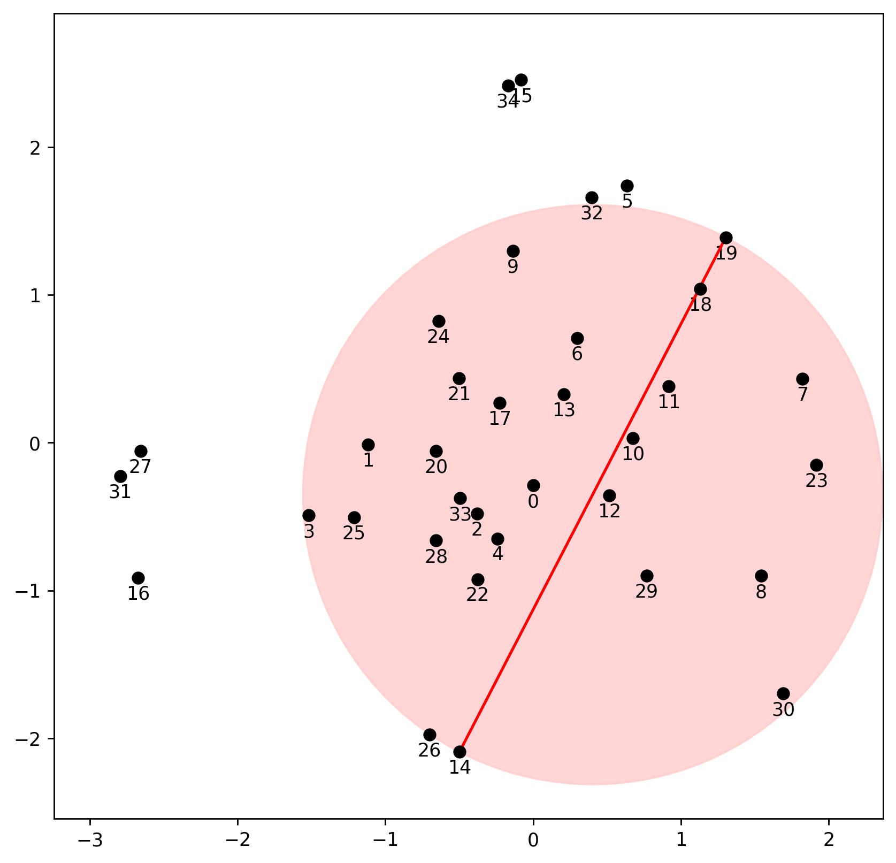
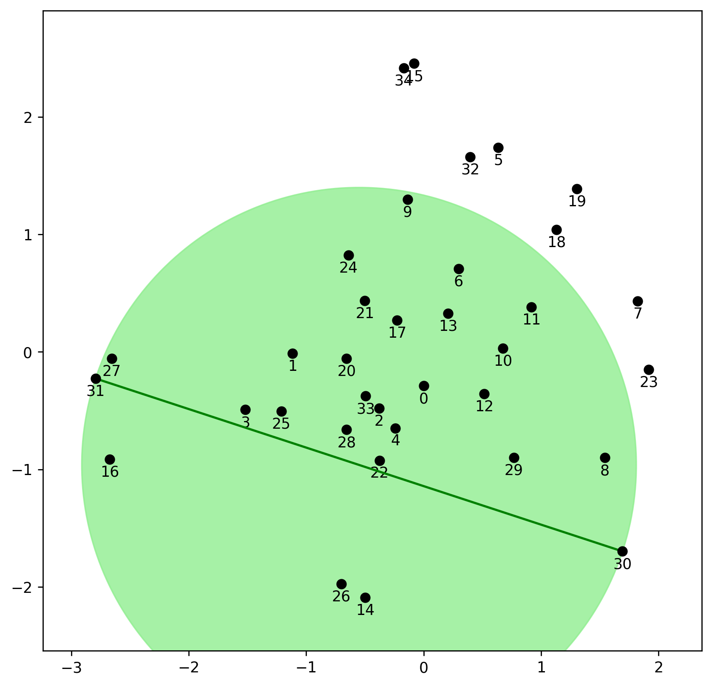
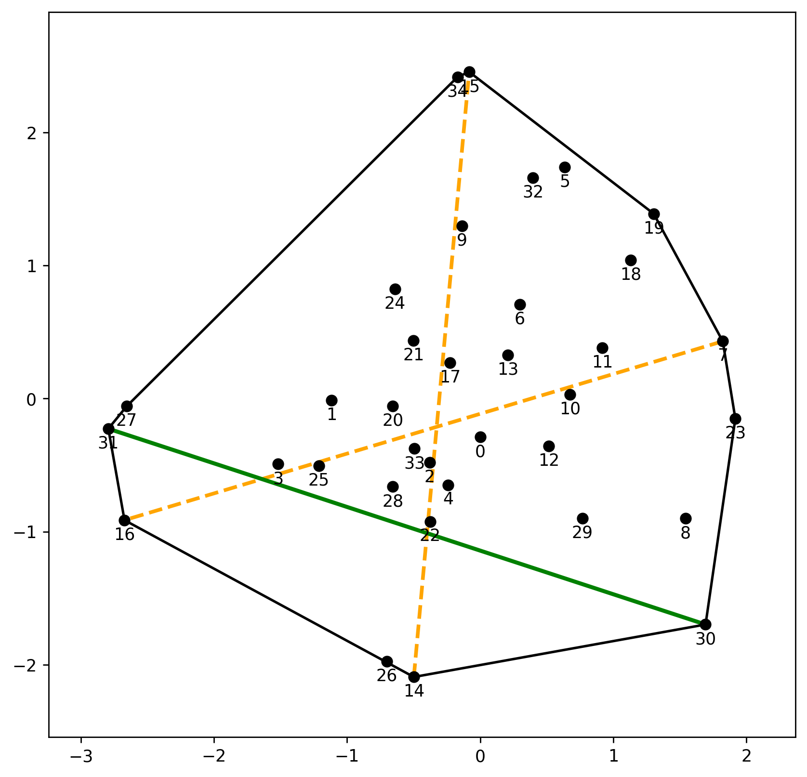

---
format: gfm
tags: ["posts"]
layout: single_md.pug
title: "Computing the Diameter in any dimension"
author: "Matt Piekenbrock"
date: '2023-10-29'
slug: diameter_2
include_toc: true
categories: ["C++"]
draft: true 
--- 

## A series of clever observations

In 2001, Malandain and Boissonatt ([1](#references)) published a way of
getting at $D(X)$ quickly using a few clever observations.

Let $p, q \in X$ denote a pair of points satisfying $D(X) = d_X(p,q)$,
i.e. a pair whose distance yields the diameter of $X$. Note there may be
several of these, though we just need one; call these
maximal pairs.

1.  If there exists a pair $x, x' \in X$ satisfying $d_X(x, x') < D(X)$,
    then at least one of $(p,q)$ lies outside of the ball $B[x, x']$,
    where:
    $$ B[x, x'] = B\left( \frac{x + x'}{2}, \frac{d_X(x, x')}{2} \right ) $$

2.  If $x, x' \in X$ are any two points such that
    $X /\ B[x,x'] = \emptyset$, then $D(X) = d_X(x, x')$

3.  Let $F(x) \subset X$ denote the set of points of $X$ furthest away
    from $x \in X$, and let:  
    $$ H = \{(x, x') : x \in F(x'), x' \in F(x) \} $$

denote the set of so-called *double normals*. Since these pairs are each
in the others furthest point sets, they must lie on the boundary of the
convex hull. Thus $H \subset \mathcal{C}(X)$.

<!-- 

   </img>
   </img>
   </img>

  -->

Let’s see what each of these observations afford us.

### Observation \#1

<blockquote class="not-prose">

If $x, x' \in X$ are any two points such that $d_X(x, x') < D(X)$, then
at least one of $(p,q)$ lies outside of the ball $B[x, x']$, where:
$$ B[x, x'] = B\left( \frac{x + x'}{2}, \frac{d_X(x, x')}{2} \right ) $$

</blockquote>

The idea underlying this simple observation is that if we find a ball
$B[x,x']$ covering a large portion of $X$ for some pair $x, x' \in X$
and $X /\ B[x,x'] \, \cancel= \, \emptyset$, then we know the set
$X /\ B[x,x']$ contains at least one of the points making up a maximal
pair. Thus, if we only want to find one point in a maximal pair, we may
eliminate all points in $X \cap B[x,x']$ from consideration. For
example, consider the pair of points whose bounding sphere is the red
sphere shown above. Clearly the red-ball does not cover $X$, thus we
know at least one point of a maximal pair exists outside of this ball.
This fact itself can lead to removing large chunks of unnecessary
computations done in the brute force case.

### Observation \#2

The second idea gives a partial stopping condition for the diameter
computation.

<blockquote class="not-prose">

If $x, x' \in X$ are any two points such that
$X /\ B[x,x'] = \emptyset$, then $D(X) = d_X(x, x')$

</blockquote>

Thus, if we find a pair of points whose corresponding ball $B[x, x']$
contains all of $X$, then we’re done: $d_X(x, x') = D(X)$.

However, the converse is not necessarily true, as demonstrated by the
second picture.

In general, it may be that $X /\ B[p,q]$ is non-empty, so this condition
alone is not sufficient to find a maximal pair.

### Observation \#3

<blockquote class="not-prose">

Let $F(x) \subset X$ denote the set of points of $X$ furthest away from
$x \in X$, and let $H$ denote the set of *double normals*, defined as:

$$ H = \{(x, x') : x \in F(x'), x' \in F(x) \} $$

Since these pairs are mutually in the others furthest point sets, they
must lie on the boundary of the convex hull. Thus
$H \subset \mathcal{C}(X)$.

</blockquote>

This observation is essentially a more refined version of the convex
hull observation and provides an intuitive generalization of the the
pairs of antipodal points the rotating calipers method is based on to
higher dimensions. Observe that a pair $(p, q)$ with distance
$d_X(p, q) = D(X)$ matching the diameter of $X$ *must* be a double
normal: if there was any point further away from $p$ than $q$ is, then
that pair would have a distance larger than $D(X)$ (and vice versa).
Thus, both $p$ and $q$ must belong to $H$.

</img>

Both the convex hull $\mathcal{C}(X)$ and the set $H$ of double-normals
are shown in the right-most image above. The black lines traverse the
boundary of $\mathcal{C}(X)$, the green line connects the maximal pair
whose distance yields the diameter, and the orange lines demarcate other
double-normals. Observe $H \subset \mathcal{C}(X)$, thus if we can find
double-normals quickly, we may be able to find the diameter quickly as
well.

## Conclusions: Part I

Amazingly, the short list of ideas and observations described so far are
all that is needed to produce an efficient algorithm for computing the
diameter of a point set in $d$ dimensions in $\approx O(nh)$ time. The
algorithm is simple, but does require more of an explanation than given
so far—I defer its full description until Part II, which I will cover in
my next posting.

<h2 id="#references">
References
</h1>

1.  Malandain, Grégoire, and Jean-Daniel Boissonnat. “Computing the
    diameter of a point set.” International Journal of Computational
    Geometry & Applications 12.06 (2002): 489-509.
