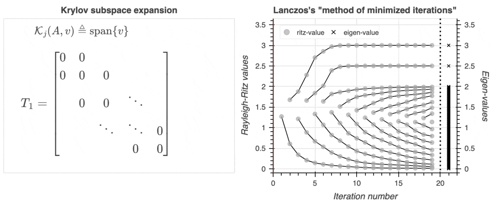

<!-- Whether for simplifying the representation of complicated systems, characterizing the asymptotic behavior of differential equations, or just fitting polynomials via least-squares, the decompositional approach to matrix computation remains the primary mode with which    -->
<!-- in many areas of sciences and engineering.  -->

Central to the theory of matrix factorization is the [spectral
theorem](https://en.wikipedia.org/wiki/Spectral_theorem), which provides
conditions under which a linear operator
$A : \mathbb{R}^n \to \mathbb{R}^n$ can be *diagonalized* in terms of
its eigenvectors: $$ A = U \Lambda U^{-1} $$

When $A$ is symmetric, the eigen-decomposition is not only guarenteed to
exist, but its [canonical
form](https://en.wikipedia.org/wiki/Canonical_form) may be obtained via
*orthogonal diagonalization*. Such matrices are among the most commonly
encountered matrices in applications.

In 1950, Cornelius Lanczos proposed an algorithm for obtaining by
different kind of factorization of $A \in \mathrm{Sym}_n$ by means of
*tri-diagonalization*:
$$  AQ = Q T \quad \Leftrightarrow \quad Q^T A Q = T $$

Like the eigen-decomposition, the “outer” term(s) $Q$ orthogonally
project $A$ to a highly structured “inner” matrix $T$. Unlike the
eigen-decomposition, this factorization has no canonical form and does
not readily yield the eigensets of $A$, prompting questions of its
utility.

<!-- The algorithm by which one produces such a $T$ is now known as the *Lanczos method*.  -->
<!-- Indeed, nearly all large-scale eigen-solvers are two phase algorithms which first transform their inputs into tridiagonal form.  -->

Nonetheless, this decomposition ended up proving to be one of the most
revealing spectral decompositions of all time. Despite its age, Lanczos’
method of tridiagonalization remains the standard algorithm1
for both computing eigensets and solving linear systems in the
large-scale regime. An [IEEE guest
editorial](https://www.computer.org/csdl/magazine/cs/2000/01/c1022/13rRUxBJhBm)
places it among the **top 10 most influential algorithms of the 20th
century**.

<!-- represents no longer contains the eigenvectors of $A$ nor  -->
<!-- The algorithm by which one produces such a $T$ is known as the *Lanczos method*. -->
<!-- So what is the Lanczos method, how does it work, and why should you care? Well, here's a teaser of what the Lanczos method accomplishes:  -->

<figure>

<figcaption aria-hidden="true">Lanczos’ “method of minimized iterations”
on a 100x100 matrix with eigenvalues (0, 0.01, 0.02, …, 2, 2.5,
3)</figcaption>
</figure>

<!-- To decipher the rest, read on! -->
<!-- In fact, you may have learned the Lanczos method before without knowing it. 
The Lanczos method naturally manifest: 
&#10;- As the _conjugate gradient_ method
- The _theory of orthogonal polynomials_
- As the means of obtaining _Gaussian quadrature_ rules on the cumulative spectral density
- As the means of generating _orthogonal projectors_ onto Krylov subspaces
- As the _Rayleigh Ritz_ algorithm applied to successive Krylov spaces
 -->

## Lanczos on a bumper sticker

Given any non-zero $v \in \mathbb{R}^n$, Lanczos generates a *Krylov
subspace* via successive powers of $A$:

$$
\mathcal{K}(A, v) \triangleq \{ \, A^{0} v, A^{1}v, A^{2}v, \dots, A^{n}v \, \}
$$

These vectors are linearly independent, so orthogonalizing them yields
not only an orthonormal basis for $\mathcal{K}(A, v)$ but also a
[change-of-basis](https://en.wikipedia.org/wiki/Change_of_basis) $Q$,
re-parameterizing $A$ by a new matrix $T$:

$$ 
\begin{align*}
K &= [\, v \mid Av \mid A^2 v \mid \dots \mid A^{n-1}v \,] && \\
Q &= [\, q_1, q_2, \dots, q \,] \gets \mathrm{qr}(K) &&  \\
T &= Q^T A Q &&
\end{align*}
$$

Since $A$ is symmetric, $T$ is guaranteed to have a *symmetric
tridiagonal structure*:

$$
T = \mathrm{tridiag} \Bigg(
\begin{array}{ccccccccc} 
& \beta_2 & & \beta_3 & & \cdot & & \beta_n & \\
\alpha_1 & & \alpha_2 & & \cdot & & \cdot & & \alpha_n \\
& \beta_2 & & \beta_3 & & \cdot & & \beta_n &
\end{array}
\Bigg)
$$

<!-- That's pretty fortunate, because computing the eigen-sets of _any_ tridiagonal matrix $T$ takes just $O(n^2)$ time[^2]! -->
<!-- $Q$ is $A$-invariant[^5] ( -->

Since $Q$ spans $\mathcal{K}(A, v) = \mathrm{range}(A)$, the
change-of-basis $A \mapsto Q^{-1} A Q$ is a [similarity
transform](https://en.wikipedia.org/wiki/Matrix_similarity)—an
equivalence relation on $\mathrm{Sym}_n$—thus we can obtain $\Lambda$ by
*diagonalizing* $T$:

$$ T = Y \Lambda Y^T $$
<!-- $$ T = Y \Theta Y^T, \mathrm{diag}(Y) = (\theta_1, \theta_2, \dots, \theta_n)$$ -->

As $T$ is quite structured, it is easy to diagonalize, and in doing so
we have effectively solved the eigenvalue problem for $A$. To quote the
[Lanczos introduction from
Parlett](https://apps.dtic.mil/sti/tr/pdf/ADA289614.pdf), *could
anything be more simple?*

## The “iteration” part

Lanczos originally referred to his algorithm as the *method of minimized
iterations*, and indeed nowadays it is often considered an [iterative
method](https://en.wikipedia.org/wiki/Iterative_method). Where’s the
iterative component?

If you squint hard enough, you can deduce that for every $j \in [1, n)$:

$$ A Q_j = Q_j T_j + \beta_{j+1} q_{j+1} e_{j}^T $$

Equating the $j$-th columns on both sides and rearranging yields a
*three-term recurrence*:

$$\begin{align*} 
A q_j &= \beta_{j\text{-}1} q_{j\text{-}1} + \alpha_j q_j + \beta_j q_{j+1} \\
\Leftrightarrow \quad \beta_{j} \, q_{j+1} &= A q_j - \alpha_j \, q_j - \beta_{j\text{-}1} \, q_{j\text{-}1}  
\end{align*}$$

The equation above is a variable-coefficient second-order linear
difference equation, and it is known such equations have unique
solutions; they are given below:

$$\alpha_j = q_j^T A q_j, \;\; \beta_j = \lVert r_j \rVert_2, \;\; q_{j+1} = r_j / \beta_j$$

$$
\text{where  } r_j = (A - \alpha_j I)q_j - \beta_{j\text{-}1} q_j
$$

In other words, if ($q_{j\text{-}1}, \beta_j, q_j$) are known, then
($\alpha_j$, $\beta_{j+1}, q_{j+1}$) are completely determined. In
theory, this means we can *iteratively* generate both $Q$ and $T$ using
just a couple vectors at a time—no explicit QR call needed. Pretty
nifty, eh!

## Wait, isn’t $T$ arbitrary?

Unlike the spectral decomposition2, there is no canonical
choice of $T$. Indeed, as $T$ is a family with $n - 1$ degrees of
freedom and $v \in \mathbb{R}^n$ was chosen arbitrarily, there are
infinitely many *essentially distinct* such decompositions.

**Not all hope is lost though**. It turns out that $T$ is actually fully
characterized by the pair $(A, v)$. To see this, notice that since $Q$
is an orthogonal matrix, we have:

$$ Q Q^T = I_n = [e_1, e_2, \dots, e_n] $$

By extension, given an initial pair $(A, q_1)$ satisfying
$\lVert q_1 \rVert = 1$, the following holds:

$$
K_n(A, q_1) = Q Q^T K_n(A, q_1) = Q[ \, e_1 \mid T e_1 \mid T^2 e_1 \mid \dots \mid T^{n-1} e_1 \, ]
$$

…this *is* a **QR** factorization, which is [essentially
unique](https://www.math.purdue.edu/~kkloste/cs515fa14/qr-uniqueness.pdf)!
Indeed, the Implicit Q Theorem asserts that if an upper Hessenburg
matrix $T \in \mathbb{R}^{n \times n}$ has only positive elements on its
first subdiagonal and there exists an orthogonal matrix $Q$ such that
$Q^T A Q = T$, then $Q$ and $T$ are *uniquely determined* by $(A, q_1)$.

<!-- Moreover, so long as $T$ has non-zero subdiagonal entries, its the eigenvalues must be distinct -->

## The end of the beginning

Nowadays, the Lanczos method lies at the core of a *host* of methods
aimed at approximating various spectral quantities, and modern
implementations of the Lanczos method deviate wildly from the original
conception. Whether for computing eigenvalues (Parlett 1993), solving
linear systems (Saad 1987), or approximating matrix functions (Musco,
Musco, and Sidford 2018), applications of the Lanczos method are quite
diverse.  
<!-- extensions of theory put forward by Lanczos continue to be discovered _ad infinitum_.  -->

In fact, the theory underlying the Lanczos method is intrinsically
connected to many other algorithms and mathematical constructs, popular
examples including the *Rayleigh Ritz* procedure, the *conjugate
gradient* method, and notions of *Gaussian quadrature*. As each of these
deserve their own post, I’ll defer them to later postings.

In the next post, I’ll cover more of the algorithmic components of the
Lanczos method, including the pseudo-code, actual code, the time and
space complexities, and additional nuances regarding the stability of
the computation.

## References

Musco, Cameron, Christopher Musco, and Aaron Sidford. 2018. “Stability
of the Lanczos Method for Matrix Function Approximation.” In
*Proceedings of the Twenty-Ninth Annual ACM-SIAM Symposium on Discrete
Algorithms*, 1605–24. SIAM.

Parlett, Beresford N. 1993. “Do We Fully Understand the Symmetric
Lanczos Algorithm Yet.” *Brown Et Al* 3: 93–107.

Saad, Youcef. 1987. “On the Lanczos Method for Solving Symmetric Linear
Systems with Several Right-Hand Sides.” *Mathematics of Computation* 48
(178): 651–62.

<h3>
Footnotes
</h3>

1.  A variant of the Lanczos method is actually at the heart of
    `scipy.sparse.linalg`’s default `eigsh` solver (which is a port of
    [ARPACK](https://en.wikipedia.org/wiki/ARPACK)).
2.  The spectral decomposition $A = U \Lambda U^T$ is canonical in the
    sense that it identifies a diagonalizable $A$ with its spectrum
    $\Lambda(A)$ up to a change of basis $A \mapsto M^{-1} A M$
    <!-- 2. For general $A \in \mathbb{R}^{n \times n}$, computing the spectral-decomposition is essentially bounded by the matrix-multiplication time: $\Theta(n^\omega)$ time and $\Theta(n^2)$ space, where $\omega \approx 2.37\dots$ is the matrix multiplication constant. If we exclude the Strassen model for computation, we get effectively a $\Omega(n^3)$ time and $\Omega(n^2)$ space bound. -->
    <!-- 3. Recall that if $S \subseteq \mathbb{R}^n$, then $S$ is called an _invariant subspace_ of $A$ or $A$-\emph{invariant} iff $x \in A \implies Ax \in S$ for all $x \in S$ -->

