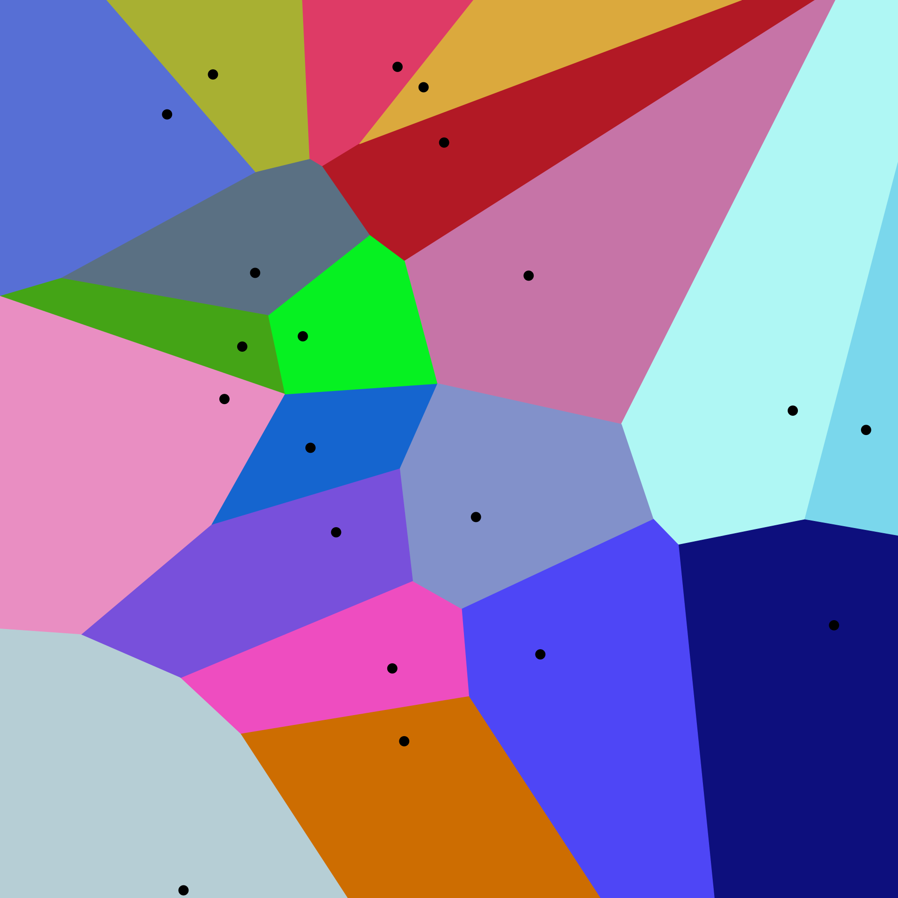
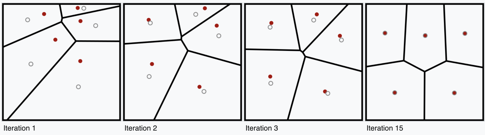
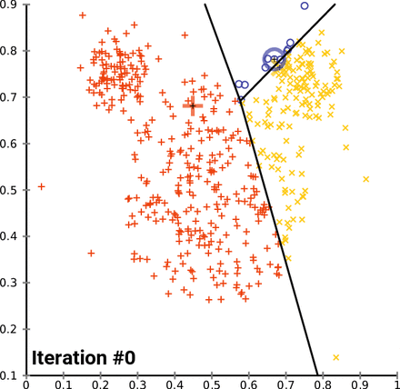
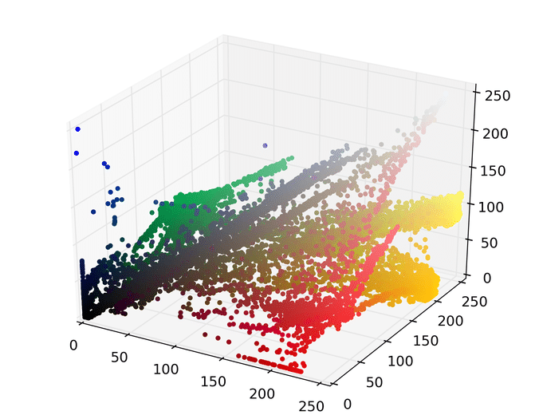

```{python}
#| echo: false
#| output: true
import numpy as np 
from scipy.spatial import voronoi_plot_2d, Voronoi
from scipy.spatial.distance import cdist 
from bokeh.plotting import output_notebook, figure, show
from bokeh.layouts import row, column
from typing import OrderedDict
output_notebook(verbose=False, hide_banner=True)
```

Given data points $X \subset \mathbb{R}^{d}$ and a constant $k > 0$, a natural clustering of $X$ into $k$ groups is one satisfying:

$$ S^\ast = \argmin\limits_{\mathbf{S}} \sum\limits_{i=1}^k \sum\limits_{x \in S_i} \lVert x - \mu_i \rVert^2 $$

This _optimization problem_ is called the $k$_-means problem_, and the objective the $k$_-means objective_.

--- 

Some natural questions arise from this optimization: 

  1. What is $\mathbf{S}$? 
  2. Can we optimize it? 
  3. Can we approximate it? 
  4. What is it used for? 
  
#### Question 1 & 2: What is $S$ and can we optimize over it?

Let $\mathbf{S} = \{ S_i \}_{i=1}^k$ denote a _partition_ of a set $\mathcal{X}$, where the collection of subsets $S_i \subseteq \mathcal{X}$ satisfy: 
$$ \mathcal{X} = S_1 \cup S_2 \cup \dots \cup S_k, \quad\quad S_i \cap S_j = \emptyset \text{ for all } i \neq j$$

The goal of the $K$-means _problem_ is to find the optimal partitioning $\mathcal{S}$ over the _space of all possible partitions_ that minimizes the k-means objective. 

Observe any _feasible_ partition satisfying (1) must be a _Voronoi diagram_:

$$ \mathbf{S}_{\mathrm{Vor}} = \left\{ x \in \mathbb{R}^d \mid d\left(x, S_i\right) \leq d\left(x, S_j\right) \text { for all } i \neq j\right\} $$ 

{width=60% fig-align="center"}

Thus, we can restrict the optimization to only _Voronoi partitions_. 

$$ S^\ast = \argmin\limits_{\mathbf{S}_{\mathrm{Vor}}} \sum\limits_{i=1}^k \sum\limits_{x \in S_i} \lVert x - \mu_i \rVert^2 $$

Unfortunately, finding the optimal partition minimizing this objective is NP-hard, see e.g.: 

> Dasgupta, Sanjoy. "The hardness of k-means clustering." (2008).

Thus, unless $P = NP$, there is no hope for poly-time solution. 

#### Question 3: Can we approximate it?

Here's an idea for an algorithm. 

Given $X \subset \mathbb{R}^d$, suppose we fix an initial set random $k$-points $C \in \mathbb{R}^{k \times d}$, then do the following: 

1. Construct the Voronoi diagram $\mathbf{S} = \{S_i\}_{i=1}^k$ of $C$
2. Compute the centroids $\tilde{C}$ of $\mathbf{S}$
3. Replace $C \gets \tilde{C}$
4. Repeat (1-3) until convergence

This is called _LLoyds algorithm_

{width=100% text-align="center"}

It turns out this algorithm tends to do well at _approximating_ the $k$-means objective. 

---

```{python}
#| echo: True
#| output: True
np.random.seed(1234)
X1 = np.random.multivariate_normal(size=75, mean=[5,4], cov=2.5*np.eye(2))
X2 = np.random.multivariate_normal(size=50, mean=[-5,2], cov=[[5,2],[2,3]])
X3 = np.random.multivariate_normal(size=50, mean=[3,-3], cov=[[10,-1],[-1,1.5]])
X = np.r_[X1,X2,X3]

p, q = figure(width=350, height=300), figure(width=350, height=300)
p.scatter(*X1.T, color='red')
p.scatter(*X2.T, color='blue')
p.scatter(*X3.T, color='green')
q.scatter(*X.T, color='black')
show(row(p, q))
```


```{python}
#| echo: False

## Lloyd's algorithm
from collections import Counter
k = 3
k_means = np.random.uniform(size=(k, X.shape[1]), low=X.min(axis=0), high=X.max(axis=0))

def lloyds(X: np.ndarray, k: int, maxiter: int = None, centroids: np.ndarray = None, verbose: bool = False):
  k_means = centroids if centroids is not None else np.random.uniform(size=(k, X.shape[1]), low=X.min(axis=0), high=X.max(axis=0))
  k_means_dis = cdist(X, k_means)
  k_means_res = np.inf
  k_means_obj = np.sum(k_means_dis.min(axis=1))
  k_assign = k_means_dis.argmin(axis=1)
  maxiter = np.inf if maxiter is None else maxiter
  
  cc = 0
  while k_means_res > 1e-6 and cc < maxiter:
    k_assign = k_means_dis.argmin(axis=1)
    k_means = np.array([X[k_assign == ki].mean(axis=0) for ki in range(k)])
    k_means_dis = cdist(X, k_means)
    updated_obj = k_means_dis.min(axis=1)
    k_means_res = np.abs(k_means_obj - np.sum(updated_obj))
    k_means_obj = np.sum(updated_obj)
    if verbose: 
      print(f"k-means obj: {k_means_obj:.1f}, residual: {k_means_res:.3f}, cell counts: {Counter(k_assign)} (k={k})")
    cc += 1
  k_assign = k_means_dis.argmin(axis=1)
  return k_assign, k_means
```


```{python}
#| echo: False
from scipy.spatial import Voronoi

def get_voronoi(coord_x, coord_y):
  points = list(zip(coord_x, coord_y))
  vor = Voronoi(points) 

  x_patch, y_patch = [], []
  x1_patch, y1_patch = [], []
  for region in vor.regions:
    if not -1 in region:
      x1_patch, y1_patch = [], []
      for i in region:
        x1_patch.append(vor.vertices[i][0])
        y1_patch.append(vor.vertices[i][1])
    x_patch.append(np.array(x1_patch))
    y_patch.append(np.array(y1_patch))

  #This code that gets the multi lines that run indefinitely
  center = vor.points.mean(axis=0)
  ptp_bound = vor.points.ptp(axis=0)
  line_segments = []
  for pointidx, simplex in zip(vor.ridge_points, vor.ridge_vertices):
    simplex = np.asarray(simplex)
    if np.any(simplex < 0):
      i = simplex[simplex >= 0][0]  # finite end Voronoi vertex

      t = vor.points[pointidx[1]] - vor.points[pointidx[0]]  # tangent
      t /= np.linalg.norm(t)
      n = np.array([-t[1], t[0]])  # normal

      midpoint = vor.points[pointidx].mean(axis=0)
      direction = np.sign(np.dot(midpoint - center, n)) * n
      far_point = vor.vertices[i] + direction * ptp_bound.max()

      line_segments.append([(vor.vertices[i, 0], vor.vertices[i, 1]), (far_point[0], far_point[1])])

  x_vor_ls, y_vor_ls = [], []
  for region in line_segments:
    x1, y1 = [], []
    for i in region:
      x1.append(i[0])
      y1.append(i[1])
    x_vor_ls.append(np.array(x1))
    y_vor_ls.append(np.array(y1))

  ## Removing patches that were added multiple times. 
  x_patch = list(OrderedDict((tuple(x), x) for x in x_patch).values())
  y_patch = list(OrderedDict((tuple(x), x) for x in y_patch).values())
  x_vor_ls = list(OrderedDict((tuple(x), x) for x in x_vor_ls).values())
  y_vor_ls = list(OrderedDict((tuple(x), x) for x in y_vor_ls).values())
  return x_patch, y_patch, x_vor_ls, y_vor_ls


def voronoi(p: figure, X: np.ndarray):
  from bokeh.models import ColumnDataSource
  x_patch, y_patch, x_vor_ls, y_vor_ls = get_voronoi(X[:,0], X[:,1])
  source_vor = ColumnDataSource(dict(xs=x_patch, ys=y_patch))
  source_vor_ls = ColumnDataSource(dict(xs=x_vor_ls, ys=y_vor_ls))
  glyph_vor = p.patches('xs', 'ys', source=source_vor, alpha=0.3, line_width=1, fill_color='dodgerblue', line_color='black')
  glyph_ls = p.multi_line('xs', 'ys', source=source_vor_ls, alpha=1, line_width=1, line_color='black')
  return p
```

```{python}
## Lloyd's algorithm
np.random.seed(1234)
k = 3
k_init = np.random.uniform(size=(k, X.shape[1]), low=X.min(axis=0), high=X.max(axis=0))
k_colors = np.array(['orange', 'purple', 'green'])

figs = []
for i in range(6):
  cl_ids, k_means = lloyds(X, k=3, maxiter=i, centroids=k_init, verbose=False)
  p = figure(width=250, height=200, match_aspect=True, title=f"Iteration: {i}")
  p = voronoi(p, k_means)
  p.scatter(*X.T, color=k_colors[cl_ids])
  p.scatter(*k_means.T, color='red', size=6)
  p.toolbar_location = None
  figs.append(p)

show(column(row(figs[:3]), row(figs[3:])))
```

---

{width=60% fig-align="center"}

#### Question 4: What is it used for? 

Suppose a distribution $f$ is a mixture of $K$ component distributions $f_1, f_2, \dots, f_K$:

$$f(x) = \sum\limits_{i=1}^K \lambda_k f_k(x), \quad \quad \sum\limits_{i=1}^K \lambda_k = 1$$

If our data $X$ are distributed from $f$, we may wish to recover which $f_i$ each $x \in X$ came from:

$$ Z \sim \mathrm{Mult}(\lambda_1, \lambda_2, \dots, \lambda_k), \quad \quad \text{ where } X \sim f_Z $$

We've already seen an instance of this.

```{python}
#| echo: false 
def contours(
  p: figure, mean: np.ndarray, cov: np.ndarray, 
  n_levels: int = 10, x_rng: tuple = (-12,12), y_rng: tuple = (-5,9), 
  **kwargs
):
  from scipy.stats import multivariate_normal
  x, y = np.meshgrid(np.linspace(*x_rng, 200), np.linspace(*y_rng, 200))
  z = np.reshape(multivariate_normal.pdf(np.c_[np.ravel(x), np.ravel(y)], mean=mean, cov=cov), x.shape)
  levels = np.linspace(np.min(z), np.max(z), n_levels)
  p.contour(x=x,y=y,z=z,levels=levels, **kwargs)
  return p
```

```{python}
p, q = figure(width=350, height=300), figure(width=350, height=300)
p.scatter(*X1.T, color='red')
p.scatter(*X2.T, color='blue')
p.scatter(*X3.T, color='green')

p = contours(p, mean=[5,4], cov=2.5*np.eye(2), fill_color=None, line_color='red')
p = contours(p, mean=[-5,2], cov=[[5,2],[2,3]], fill_color=None, line_color='blue')
p = contours(p, mean=[3,-3], cov=[[10,-1],[-1,1.5]], fill_color=None, line_color='green')
 
k_assign, k_means = lloyds(X, k=3, centroids=k_init)
q.scatter(*X.T, color=k_colors[k_assign])
show(row(p, q))
```

--- 

#### Example 2: Image segmentation

Suppose we want to segment an image for compression: 

{width=75% fig-align='center'}

First, let's just map the image to RGB (pixel) space: 

{width=75% fig-align='center'}

Running Lloyds algorithm with $k=7$ and then mapping each point to its closest centroid yields: 

{width=75% fig-align='center'}


#### Going further 

The $k$_-means++_ algorithm carefully chooses seed-points in such as way that guarantees the k-means objective $\phi_{++}$ is an $O(\log k)$-approximation in expectation to the global optimum $\phi_{\mathrm{opt}}$

$$\mathbb{E}[\phi_{++}] \leq 8(\mathrm{ln}(k) + 2) \phi_{\mathrm{opt}}$$

This, along with many others, is available in SciPy under the `kmeans2` function. 

```{python}
#| echo: False
#| output: false

# %% 
# np.array([y[k_assign == ki] for ki in range(k)])
# from collections import Counter
# for j in range(k):
#   cluster_j = y[k_assign == j]
#   cluster_cc = Counter(cluster_j)
#   cluster_cls = int(cluster_cc.most_common(1)[0][0])
#   cluster_purity = np.sum(cluster_j == cluster_cls) / len(cluster_j)
#   print(f"Cluster {j} purity: {cluster_purity}")


# from scipy.cluster.vq import kmeans2
# from scipy.cluster.vq import vq, whiten
# X_norm = whiten(X).astype(np.float32)

# for s in range(5):
#   centroid, label = kmeans2(X_norm, k = 10, iter=60, minit='++', seed = s * 128)
#   purities = []
#   for j in range(k):
#     cluster_j = y[label == j]
#     cluster_cc = Counter(cluster_j)
#     cluster_cls = int(cluster_cc.most_common(1)[0][0])
#     cluster_purity = np.sum(cluster_j == cluster_cls) / len(cluster_j)
#     # print(f"Cluster {j} purity: {cluster_purity}")
#     purities.append(cluster_purity)
#   print(f"{s}: {np.mean(purities):.3f}")
```


```{python}
#| echo: false 
#| output: false

# from scipy.spatial import Voronoi
# def bbox(X):
#   x_min, y_min = X.min(axis=0)
#   x_max, y_max = X.max(axis=0)
#   return np.array([[x_min, y_min], [x_min, y_max], [x_max, y_min], [x_max, y_max]])

# def lloyds(centroids: np.ndarray):
#   centroids = np.r_[centroids, bbox(centroids) * 1.05]
#   vor_diagram = Voronoi(centroids)
#   vor_diagram.vertices
#   pass
```